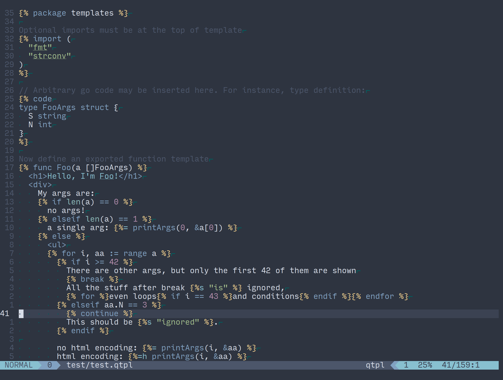

# quicktemplate.vim :rocket:
### Better Vim syntax highlighting for Quicktemplate

[Quicktemplate](https://github.com/valyala/quicktemplate) is a compiled templating engine for Go.

It has a unique syntax where all top-level text is considered a comment by default,
and directives wrapped in pairs of `` are used to specify desired behavior.

Many of these directives allow for embedded HTML or Go code, making good syntax 
highlighting support vital for effective and efficient development of templates.



### Installation

Use your favorite plugin manager such as [Vundle](https://github.com/VundleVim/Vundle.vim), 
[Pathogen](https://github.com/tpope/vim-pathogen), or [Dein](https://github.com/Shougo/dein.vim).

`quicktemplate.vim` depends on an external plugin called [`builder.vim`](https://github.com/b0o/builder.vim), which you must
also install.

Using [Dein](https://github.com/Shougo/dein.vim): 
```viml
call dein#add('b0o/builder.vim')
call dein#add('b0o/quicktemplate.vim', {'depends': 'b0o/builder.vim'})
```

### License

&copy; 2018 Maddison Hellstrom. Released under the MIT License.
